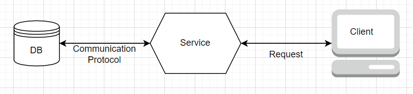
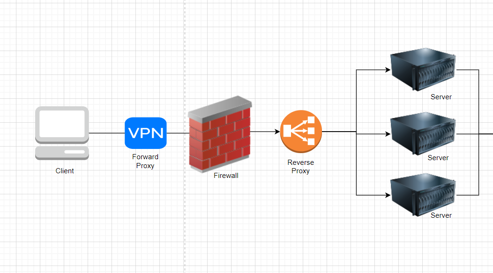
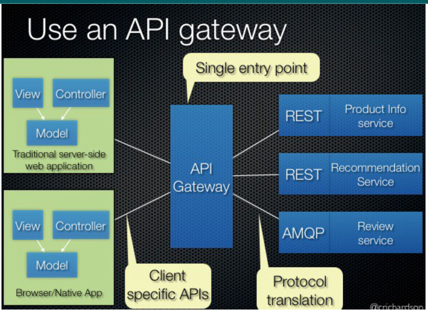

# System Design- Proxy
## Concepts and Consideration of Proxy's in System Design

### Concepts
A proxy server is an intermediary piece of hardware/software sitting between the client and the backend server.  

* **Filter requests**: It runs every request through a filter, looking up each address in its database of allowed or disallowed sites, and it allows or blocks each request based on its internal database. A system administrator can configure the proxy server to allow or block certain sites.  
* Log Requests
* Transform Request (encryption, compression, etc)
* **Cache** : A caching proxy server can also improve web performance by caching frequently used pages so the user request doesn’t have to go all the way out to the Internet at large to get some of the data it needs to display a particular page.
* Batch Request
* **Collapsed forwarding**: enable multiple client requests for the same URI to be processed as one request to the backend server
* Collapse requests for data that is spatially close together in the storage to minimize the reads
* **Security**: A proxy server can also be used to beef up security for a business. A proxy server can provide network address translation, which makes the individual users and computers on the network anonymous when they are using the Internet. This makes it much harder for hackers to access individual computers on the network.

### Proxy Server Types

#### Open-Proxy
Also known as forward proxy, is a proxy server that is accessible by any Internet user. Generally, a proxy server only allows users within a networking group (i.e. a closed proxy) to store and forward Internet services such as DNS or web pages to reduce and control the bandwidth used by the group. With an open proxy, however, any user on the Internet is able to use this forwarding service.

Proxy servers act as an intermediary between a user’s computer and their server, enabling users to hide their location and access websites that may be blocked by their internet provider. An open proxy is a server configured to allow anyone to use it.

An open proxy server is intentionally made available for general public access and lacks internet security regulations or connection rules. However, many proxy servers that are supposed to be private are often left open due to misconfigured proxy settings.
As a result, open proxy servers are frequently targeted by cyber criminals to identify potential victims and share malware, such as spam and viruses, or illegal content. That is because proxies hide the individual’s Internet Protocol (IP) address from their recipients and treat all incoming connections with the same level of fairness. This means the open proxy server does not check, encrypt, or filter data or content that comes into the server.

#### Reverse Proxy 
A reverse proxy retrieves resources on behalf of a server from one or more servers. These resources are then returned to the client, appearing as if they originated from the proxy server itself. It typically sits behind the firewall in a private network and directs client requests to the appropriate backend server. A reverse proxy provides an additional level of abstraction and control to ensure the smooth flow of network traffic between clients and servers.

Common uses for a reverse proxy server include:

* **Load balancing** - A reverse proxy server can act as a “traffic cop,” sitting in front of your backend servers and distributing client requests across a group of servers in a manner that maximizes speed and capacity utilization while ensuring no one server is overloaded, which can degrade performance. If a server goes down, the load balancer redirects traffic to the remaining online servers.
* **Web Acceleration** - Reverse proxies can compress inbound and outbound data, as well as cache commonly requested content, both of which speed up the flow of traffic between clients and servers. They can also perform additional tasks such as SSL encryption to take the load off of your web servers, thereby boosting their performance.
* **Security and anonymity** — By intercepting requests headed for your backend servers, a reverse proxy server protects their identities and acts as an additional defense against security attacks. It also ensures that multiple servers can be accessed from a single record locator or URL regardless of the structure of your local area network.

### API Gateway
#### Concept

An API gateway is an API management tool that sits between a client and a collection of backend services. An API gateway is a layer 7 (HTTP) router that acts as a reverse proxy to accept all API calls, aggregate the various services required to fulfill them, and return the appropriate result.

With an API gateway, one simply exposes and scales a single collection of services (the API gateway) and updates the API gateway’s configuration whenever a new upstream should be exposed externally. e.g. Zuul is an L7 application gateway that is able to auto-discover services registered in the Eureka server.

Exactly what the API gateway does will vary from one implementation to another. Some common functions include authentication, routing, rate limiting, billing, monitoring, analytics, policies, alerts, and security.

#### Usecases
* **Authentication**: An API Gateway can take the overhead of authenticating an API call from outside. which can remove the check of security and lowering the network latency.

* **Load Balancing**: The API Gateway can work as an L7 load balancer to handle requests in the most efficient manner. It can keep a track of the request load it has sent to different nodes of a particular service.

* **Service discovery and requests dispatching**: it can make the communication between client and Microservices simpler. It hits all the required services and waits for the results from all services. After obtaining the response from all the services, it combines the result and sends it back to the client. An API Gateway can record the basic response time from each node of a service instance. For higher priority API calls, it can be routed to the fastest responding node.
Response transformation: Being a first and single point of entry for all API calls, the API Gateway knows which type of client is calling: mobile, web client, or other external consumers; it can make the internal call to the client and give the data to different clients as per their needs and configuration.

* **Circuit breaker**: To handle a partial failure, the API Gateway uses a technique called circuit breaker pattern, which means that after a specific threshold, the API gateway will stop sending data to the component failing. This gives time to analyze the logs, implement a fix, and push an update. Or if necessary close the circuit until the issue is solved.   

#### Pros and Cons
**Pros**
* Insulates the clients from how the application is partitioned into microservices.
* Insulates the clients from the problem of determining the locations of service instances.
* Provides the optimal API for each client.
* Reduces the number of requests/roundtrips. For example, the API gateway enables clients to retrieve data. from multiple services with a single round-trip. Fewer requests also mean less overhead and improve user experience. An API gateway is essential for mobile applications.
* Simplifies the client by moving logic for calling multiple services from the client to the API gateway.
* Translates from a “standard” public web-friendly API protocol to whatever protocols are used internally.

**Cons**
* Increased complexity — the API gateway is yet another moving part that must be developed, deployed, and managed
* Increased response time due to the additional network hop through the API gateway — however, for most applications the cost of an extra roundtrip is insignificant.

### Implementation
* Microsoft API Management: https://azure.microsoft.com/en-us/services/api-management/
* Amazon AWS API Gateway: https://docs.aws.amazon.com/apigateway/latest/developerguide/welcome.html

### References
