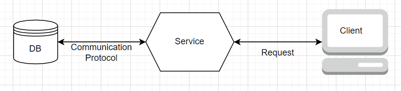
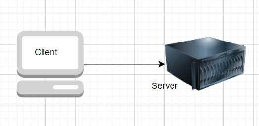
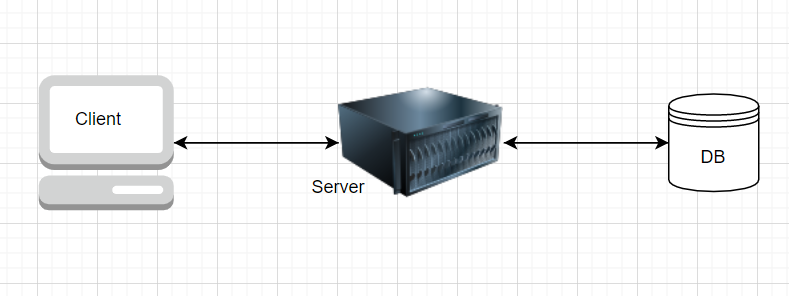
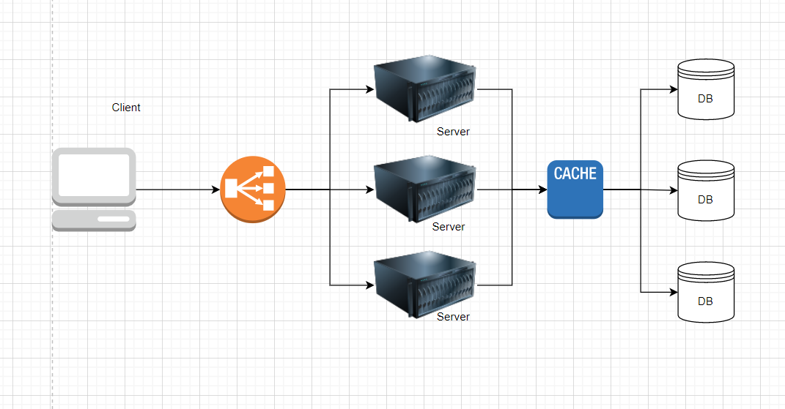

# System Introduction

Architecture is a collection of tech that serves a set of users to fulfill a set of requirements
ex: Netflix, hospital, etc.

## Components of System Design
1. Logical Entity: ex db, service, cloud, etc.
2. tangible Entity: ex mongoDB, AWS, etc.

## Sample Architecture

1. Communication Protocol: A communication protocol is a system of rules that allows two or more entities of a communications system to transmit information via any kind of variation of a physical quantity.
2. Request API: An application programming interface is a way for two or more computer programs to communicate with each other. It is a type of software interface, offering a service to other pieces of software.

## Client Server Architecture

* Client
* Server
* Thick Client vs Thin Client
* 2-tier, 3-tier, n-tier Architecture

1. 2-Tier Architecture

The Communication here happens via Request-Response API and the core logic and data usually resides at server side.

2. 3-Tier Architecture

In 3 tier architecture, a data layer is introduce and serve only handles the logic.

3. Thick vs Thin Client:
   * Thick Client: When the logical manipulation happens on presentation layer or the core logic resides on client side, it is called thick client.   
   Ex: Video/photo editing software.
   * Thin Client: When the logical manipulation happens on server side or logic resides on server then it is called thin client.  
   Ex: Amazon, etc.

4. N-Tier Architecture

N-Tier system can also have more than 3 layers such as load balancers and caching layer, etc. This is usually in case of large distributed systems.

