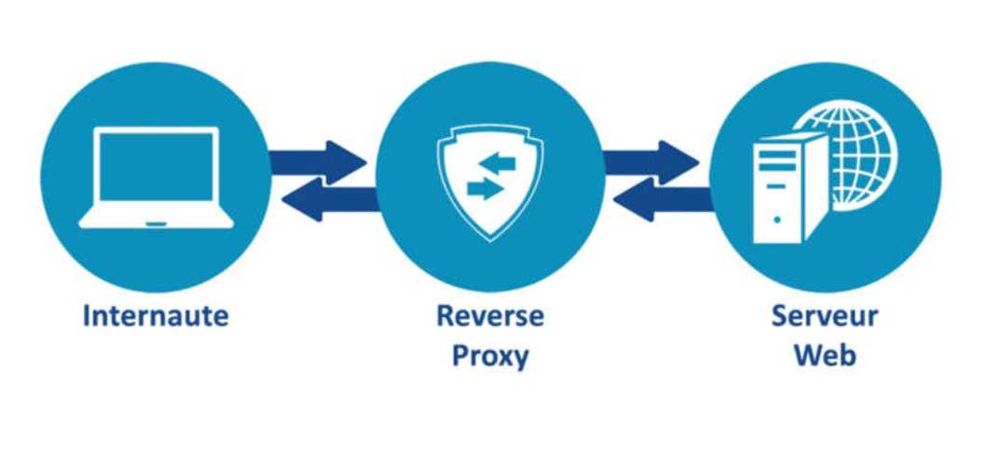

# System Introduction

Architecture is a collection of tech that serves a set of users to fulfill a set of requirements
ex: Netflix, hospital, etc.

## Components of System Design
1. Logical Entity: ex db, service, cloud, etc.
2. tangible Entity: ex mongoDB, AWS, etc.

## Sample Architecture

1. Communication Protocol: A communication protocol is a system of rules that allows two or more entities of a communications system to transmit information via any kind of variation of a physical quantity.
2. Request API: An application programming interface is a way for two or more computer programs to communicate with each other. It is a type of software interface, offering a service to other pieces of software.

