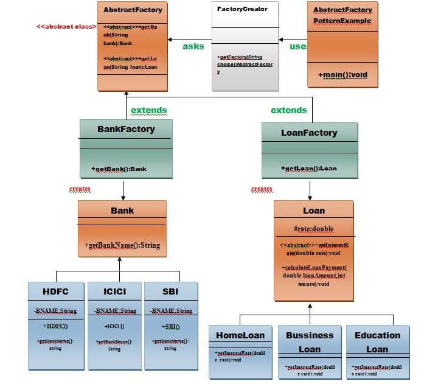

# Abstract Factory Pattern

#### Abstract Factory patterns work around a super-factory which creates other factories. This factory is also called as factory of factories. This type of design pattern comes under creational pattern as this pattern provides one of the best ways to create an object.

#### In Abstract Factory pattern an interface is responsible for creating a factory of related objects without explicitly specifying their classes. Each generated factory can give the objects as per the Factory pattern.

#### Abstract Factory Pattern says that just define an interface or abstract class for creating families of related (or dependent) objects but without specifying their concrete sub-classes.That means Abstract Factory lets a class returns a factory of classes. So, this is the reason that Abstract Factory Pattern is one level higher than the Factory Pattern.

#### An Abstract Factory Pattern is also known as **Kit**.

## Advantage of Abstract Factory Pattern

1. Abstract Factory Pattern isolates the client code from concrete (implementation) classes. 


2. It eases the exchanging of object families. 


3. It promotes consistency among objects.


## Usage of Abstract Factory Pattern
* When the system needs to be independent of how its object are created, composed, and represented.
* When the family of related objects has to be used together, then this constraint needs to be enforced.
* When you want to provide a library of objects that does not show implementations and only reveals interfaces.
* When the system needs to be configured with one of a multiple family of objects.

## Implementation
We are going to create a Shape interface and a concrete class implementing it. We create an abstract factory class AbstractFactory as next step. Factory class ShapeFactory is defined, which extends AbstractFactory. A factory creator/generator class FactoryProducer is created.

AbstractFactoryPatternDemo, our demo class uses FactoryProducer to get a AbstractFactory object. It will pass information (CIRCLE / RECTANGLE / SQUARE for Shape) to AbstractFactory to get the type of object it needs.

  

### Step 1
Create an interface/abstract class for type of object we want.
```java
/*
        Interface for Bank object
        Interface: bank.java
 */

public interface bank{
    String getBankName();
}

/*
        Abstract class for loan object
        Abstract class: loan.java 
 */
public abstract class loan{
    int interest_rate;
    abstract calculateInterest();
}
```
### Step 2
Create concrete classes implementing the same interface and abstract class.

```java
//====================classes implementing bank interface=================
/*
        Class: hdfc.java
 */
public class hdfc implements bank{
    public String getBankName(){
        return "HDFC";
    }
}

/*
        Class: SBI.java
 */
public class SBI implements bank{
    public String getBankName(){
        return "SBI";
    }
}

/*
        Class: icici.java
 */
public class icici implements bank{
    public String getBankName(){
        return "icici";
    }
}

//=====================Classes implementing "Loan" abstract class=================
/*
        Class: BusinessLoan.java
 */
public class BusinessLoan extends loan{
    int interest_rate = 12;
    public int calculateInterest(){
        /*
                logic
         */
        return -1;
    }
}

/*
        Class: EducationLoan.java
 */
public class EducationLoan extends loan{
    int interest_rate = 10;
    public int calculateInterest(){
        /*
                logic
         */
        return -1;
    }
}

/*
        Class: HomeLoan.java
 */
public class HomeLoan extends loan{
    int interest_rate = 10;
    public int calculateInterest(){
        /*
                logic
         */
        return -1;
    }
}
```

### Step 3
Create an abstract class (i.e. AbstractFactory) to get the factories for Bank and Loan Objects.
```java
/*
        Abstract class: FactoryOfFactory.java
 */
public abstract class FactoryOfFactory{
    public abstract getBank(String bank);
    public abstract getLoan(String loan);
}
```

### Step 4
Create factories we required class object.
```java
/*
        Class: BankFactory.java
 */
public class BankFactory extends FactoryOfFactory{
    public bank getBank(String bank){
        if(bank == null){
            return null;
        }else if(bank.equalsIgnoreCase("HDFC")){
            return new hdfc();
        }else{
            /*
                    Similarly for SBI and ICICI. 
             */
        }
        return null;
    }
    public loan getLoan(){
        return null;
    }
}

/*
        Class: LoanFactory.java
 */
public class LoanFactory extends FactoryOfFactory{
    public bank getBank(String bank){
        return null;
    }
    public loan getLoan(String loan){
        if(loan == null){
            return null;
        }
        if(loan.equalsIgnoreCase("Home_loan")){
            return new HomeLoan();
        }else if(loan.equalsIgnoreCase("Education_loan")) {
                /*
                        similarly for education and business loan
                 */
        }
        return null;
    }
}
```

### Step 5
Create factory creater class to create factory of required class loan or bank
```java
/*
        Class: FactoryCreater.java
 */
public class FactoryCreater{
    public FactoryOfFactory getFactory(String factoryName){
        if(factoryName == null){
            return null;
        }else if(factoryName.equalsIgnoreCase("loan_factory")){
            return new LoanFactory();
        }else if(factoryName.equalsIgnoreCase("bank_factory")){
            return new BankFactory();
        }
    }
}
```

### Step 6
Use the FactoryCreator to get AbstractFactory in order to get factories of concrete classes by passing an information such as type.

```java
/*
        Class: createObject.java
 */
class AbstractFactoryPatternExample {
    public static void main(String args[]) throws IOException {

        BufferedReader br = new BufferedReader(new InputStreamReader(System.in));

        System.out.print("Enter the name of Bank from where you want to take loan amount: ");
        String bankName = br.readLine();

        System.out.print("\n");
        System.out.print("Enter the type of loan e.g. home loan or business loan or education loan : ");

        String loanName = br.readLine();
        AbstractFactory bankFactory = FactoryCreator.getFactory("Bank");
        Bank b = bankFactory.getBank(bankName);

        System.out.print("\n");
        System.out.print("Enter the interest rate for " + b.getBankName() + ": ");

        double rate = Double.parseDouble(br.readLine());
        System.out.print("\n");
        System.out.print("Enter the loan amount you want to take: ");

        double loanAmount = Double.parseDouble(br.readLine());
        System.out.print("\n");
        System.out.print("Enter the number of years to pay your entire loan amount: ");
        int years = Integer.parseInt(br.readLine());

        System.out.print("\n");
        System.out.println("you are taking the loan from " + b.getBankName());

        AbstractFactory loanFactory = FactoryCreator.getFactory("Loan");
        Loan l = loanFactory.getLoan(loanName);
        l.getInterestRate(rate);
        l.calculateLoanPayment(loanAmount, years);
    }
}
```

