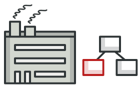
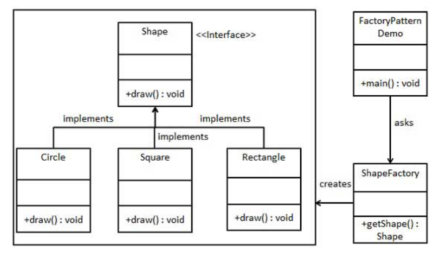

# Factory Pattern

#### Factory pattern is one of the most used design patterns in Java. This type of design pattern comes under creational pattern as this pattern provides one of the best ways to create an object.

#### In Factory pattern, we create object without exposing the creation logic to the client and refer to newly created object using a common interface. Here we define an interface or abstract class for creating an object but let the subclasses decide which class to instantiate.

#### The Factory Method Pattern is also known as **Virtual Constructor**.


## Implementation
We're going to create a Shape interface and concrete classes implementing the Shape interface. A factory class ShapeFactory is defined as a next step.

FactoryPatternDemo, our demo class will use ShapeFactory to get a Shape object. It will pass information (CIRCLE / RECTANGLE / SQUARE) to ShapeFactory to get the type of object it needs.  



## Advantage of Factory Design Pattern
1. Factory Method Pattern allows the sub-classes to choose the type of objects to create.  


2. It promotes the **loose-coupling** by eliminating the need to bind application-specific classes into the code. That means the code interacts solely with the resultant interface or abstract class, so that it will work with any classes that implement that interface or that extends that abstract class.

## Usage of Factory Design Pattern
* When a class doesn't know what sub-classes will be required to create.
* When a class wants that its sub-classes specify the objects to be created.
* When the parent classes choose the creation of objects to its sub-classes.

### Step 1
```java
/*
        Interface: shape.java
 */
public interface Shape {
   void draw();
}
```
### Step 2
Create class that implement the interface
```java
/*
         Class: Rectangle.java
 */
public class Rectangle implements Shape {

    @Override
    public void draw() {
        System.out.println("Inside Rectangle::draw() method.");
    }
}

/*
        Class: Square.java 
 */
public class Square implements Shape {

    @Override
    public void draw() {
        System.out.println("Inside Square::draw() method.");
    }
}

/*
        Class: Circle.java
 */
public class Circle implements Shape {

    @Override
    public void draw() {
        System.out.println("Inside Circle::draw() method.");
    }
}
```

### Step 3
Create a factory class to create required objects of above class based on our requirement.

```java
/*
        Factory Class: Shape_Factory.java
 */
public class ShapeFactory {
	
   //use getShape method to get object of type shape 
   public Shape getShape(String shapeType){
      if(shapeType == null){
         return null;
      }		
      if(shapeType.equalsIgnoreCase("CIRCLE")){
         return new Circle();
         
      } else if(shapeType.equalsIgnoreCase("RECTANGLE")){
         return new Rectangle();
         
      } else if(shapeType.equalsIgnoreCase("SQUARE")){
         return new Square();
      }
      
      return null;
   }
}
```

### Step 4
Use the Factory to get object of concrete class by passing an information such as type.  

```java
/*
        Class to create factory object: Factory_pattern.java
 */
public class FactoryPatternDemo {

    public static void main(String[] args) {
        ShapeFactory shapeFactory = new ShapeFactory();

        //get an object of Circle and call its draw method.
        Shape shape1 = shapeFactory.getShape("CIRCLE");

        //call draw method of Circle
        shape1.draw();

        //get an object of Rectangle and call its draw method.
        Shape shape2 = shapeFactory.getShape("RECTANGLE");

        //call draw method of Rectangle
        shape2.draw();

        //get an object of Square and call its draw method.
        Shape shape3 = shapeFactory.getShape("SQUARE");

        //call draw method of square
        shape3.draw();
    }
}
```

